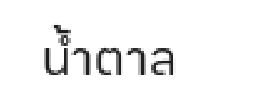

# lvgl-thai-font-tool

Fix Thai vowel stacking in TTF fonts and convert to LVGL `.c` for ESP32 — no shaping engine required.

## ปัญหา

LVGL ไม่มี text shaping engine สำหรับภาษาไทย ทำให้วรรณยุกต์และสระซ้อนทับกัน เช่น **น้ำ เที่ยว ข้อ** แสดงผลผิด

Tool นี้แก้ปัญหาโดยเลื่อน Level-2 marks (วรรณยุกต์ / thanthakat / nikhahit) ขึ้นในตัว font โดยตรง ก่อน convert เป็น LVGL bitmap font

### ตัวอย่างก่อน/หลัง




```
Level 2 → ่ ้ ๊ ๋ ์ ํ   (เลื่อนขึ้น ไม่ซ้อน Level 1)
Level 1 → ั ิ ี ึ ื ็   (ชิดบนพยัญชนะ ตำแหน่งเดิม)
Base    → ก ข ค ...
```

## Requirements

| Tool | Install |
|------|---------|
| Python ≥ 3.12 | [python.org](https://www.python.org) |
| [uv](https://docs.astral.sh/uv/) | `brew install uv` |
| [lv_font_conv](https://github.com/lvgl/lv_font_conv) | `npm install -g lv_font_conv` |

## Windows setup (เพิ่มเติม)

1. ติดตั้ง Python 3.12+ จาก python.org และติ๊ก "Add python.exe to PATH"
2. ติดตั้ง Node.js LTS (มาพร้อม `npm`)
3. ติดตั้ง uv ด้วย PowerShell:

```powershell
powershell -ExecutionPolicy Bypass -Command "irm https://astral.sh/uv/install.ps1 | iex"
```

ถ้า `uv` ยังไม่เจอ ให้ปิด/เปิดเทอร์มินัลใหม่ก่อนรันคำสั่งด้านล่าง

## Setup

```bash
git clone https://github.com/LEKPCSTEAM/LVGL-Thai-Font-Tool.git
cd lvgl-thai-font-tool
uv sync
```

## Usage

### 1. ดูข้อมูล font

```bash
uv run fix-thai MyFont.ttf --info
```

```
UPM        : 1000
Has GPOS   : True
Thai glyphs: 87

Level-1 marks (ไม่ขยับ):
  U+0E31 ั  yMin=   636  yMax=   790
  U+0E34 ิ  yMin=   636  yMax=   703
  ...

Level-2 marks (จะถูกเลื่อนขึ้น):
  U+0E48 ่  yMin=   636  yMax=   812
  U+0E49 ้  yMin=   636  yMax=   807
  ...
```

### 2. แก้ Thai mark positions

```bash
uv run fix-thai MyFont.ttf
# output: MyFont_fixed.ttf
```

```bash
# กำหนด output path
uv run fix-thai MyFont.ttf -o MyFont_lvgl.ttf

# ปรับค่า shift (default: 220 units บน UPM=1000)
uv run fix-thai MyFont.ttf --shift 250
```

### 3. แปลงเป็น LVGL `.c`

```bash
uv run to-lvgl MyFont_fixed.ttf
# output: ./output/myfont_fixed_20.c
```

```bash
# หลายขนาดในครั้งเดียว
uv run to-lvgl MyFont_fixed.ttf --size 16 20 24

# เปลี่ยน output folder
uv run to-lvgl MyFont_fixed.ttf --size 20 --output-dir ./output

# เฉพาะ Latin หรือ Thai
uv run to-lvgl MyFont_fixed.ttf --latin-only
uv run to-lvgl MyFont_fixed.ttf --thai-only

# ลด anti-aliasing (ประหยัด Flash)
uv run to-lvgl MyFont_fixed.ttf --bpp 2
```

### ทำในขั้นเดียว

```bash
uv run fix-thai MyFont.ttf && uv run to-lvgl MyFont_fixed.ttf --size 16 20 24
```

## ใช้ใน LVGL (ESP32)

คัดลอกไฟล์ `.c` เข้า project แล้วใช้งาน:

```c
LV_FONT_DECLARE(myfont_fixed_20);

lv_obj_t *label = lv_label_create(lv_scr_act());
lv_obj_set_style_text_font(label, &myfont_fixed_20, 0);
lv_label_set_text(label, "น้ำ เที่ยว ข้อ ก็ได้ Hello");
```

## ปรับ shift ถ้าสระยังซ้อนอยู่

| อาการ | แก้ไข |
|-------|-------|
| วรรณยุกต์ซ้อนสระ | เพิ่ม `--shift` เช่น `--shift 280` |
| วรรณยุกต์อยู่สูงเกินไป | ลด `--shift` เช่น `--shift 180` |

ค่า default `--shift 220` เหมาะกับ font ที่มี UPM=1000

## Font ที่ทดสอบแล้ว

| Font | ผลลัพธ์ |
|------|---------|
| LINE Seed Sans TH | ✅ |
| Kanit | ✅ |

## License

MIT
